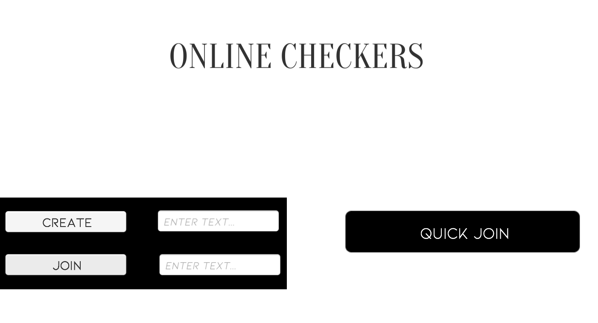
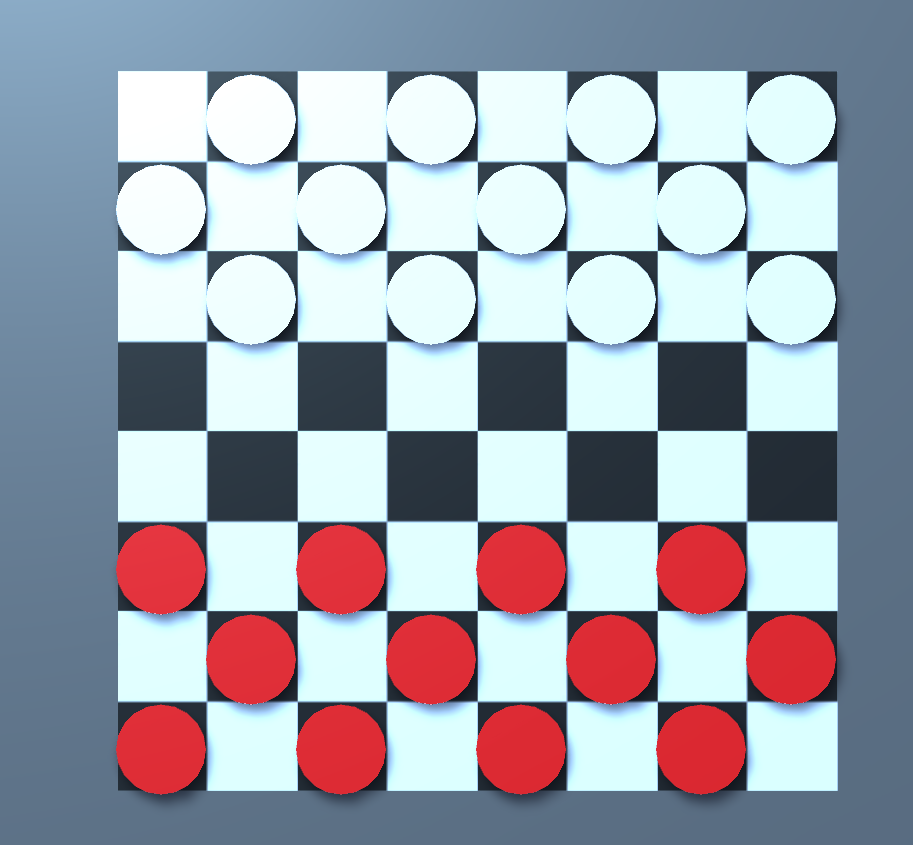

# Multiplayer Checkers

<!---Esses são exemplos. Veja https://shields.io para outras pessoas ou para personalizar este conjunto de escudos. Você pode querer incluir dependências, status do projeto e informações de licença aqui--->

> Multiplayer Checker is a online checkers game made with Unity 3D with Photon PUN 2, you can connect with another person and play some good old checkers game!
### Adjustments and improvementss

I am still developing this game, i can only work on it in my free time, so it's very slow paced

- [x] Create checkers game with rules
- [x] Connect two players online with Photon.
- [x] Make Create room and Quick join.
- [x] Select the winner based on piece count.
- [ ] Register player with SQL and PHP.
- [ ] Score all the matches with Data base.

## 💻 Requirements

Before starting, make sure you've met the following requirements:
* Unity 2020,1,6f1
* Photon PUN 2

## 📫 Contributing to Multiplayer Checkers

To contribute to Multiplayer Checkers, follow these steps:

1. Fork this repository.
2. Create a branch: `git checkout -b <branch_name>`.
3. Make your changes and commit them: `git commit -m '<message_commit>'`
4. Push to the original branch: `git push origin <project_name> / <local>`
5. Create the pull request.

## 😄 Be one of the contributors 

Want to be part of this project? Click [HERE](CONTRIBUTING.md) and read how to contribute.

## 📝 License

This project is under license. See the [LICENSE](CC-BY-4.0.md) file for more details.

